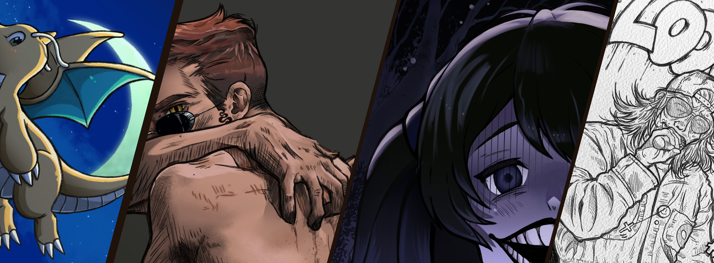

# Hi, I'm Sara Leite! ★

I'm a junior web designer and developer currently studying Computer Systems and Network Administrator (ASIR) 
with training and experience in web design, UX/UI, and digital illustration.
I'm looking for a junior role where I can keep learning (something I'm passionate about) and contribute with creativity, structure, and a technical mindset.

---

## 📜 Current projects:

- **[Personal Portfolio](https://saraleitexyz.github.io)**  
  Showcases my web design and development work with a minimalist and accessible approach.

- **[Cheeky Commit Bot](https://github.com/saraleitexyz/cheeky_commit_bot)** 
  *(Coming soon!)*

---

## 🔌 Skills & tools:

- **Frontend:** HTML, CSS, JavaScript, Web Accessibility  
- **Design:** Figma, Adobe XD, Photoshop, Canva, Clip Studio Paint  
- **Backend & Scripting:** Bash, SQL
- **Systems & Networking:** Linux, Windows, LAN, Technical Support  
- **Cybersecurity:** Foundations and applied practice (ongoing learning)

---

## 💌 Contact me:
- Email: saraleite.mail@gmail.com  
- LinkedIn: [linkedin.com/in/saraleite-ml](https://linkedin.com/in/saraleite-ml)  
- Portfolio: [saraleitexyz.github.io](https://saraleitexyz.github.io)

---

*“I make myself rich, by making my wants few.”* — Thoreau 𓋼𖤣𖥧𓋼𓍊

Thank you for visiting my profile, see ya! ♡
